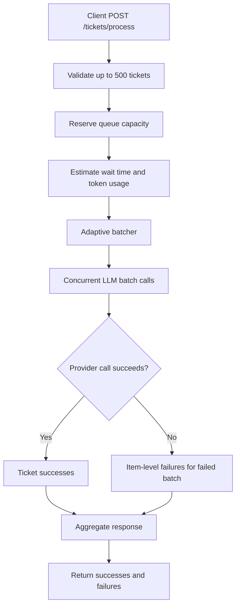
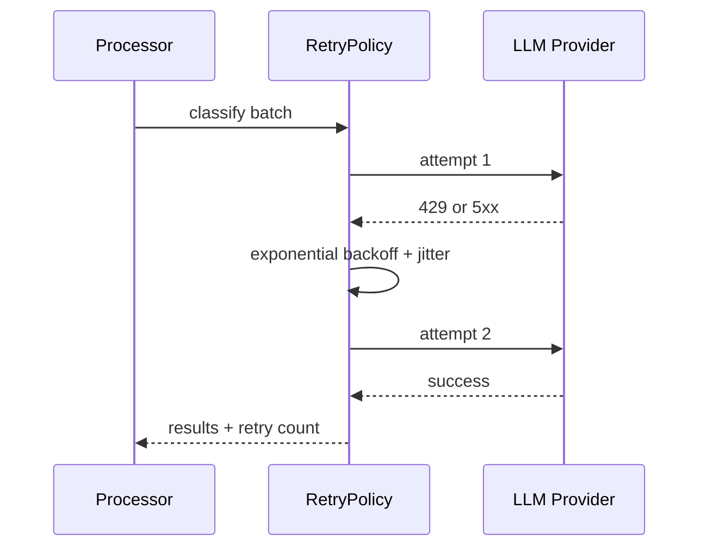

# Diagrams

## Request Processing Flow

```mermaid
flowchart TD
    A["Client POST /tickets/process"] --> B["Validate up to 500 tickets"]
    B --> C["Reserve queue capacity"]
    C --> D["Estimate wait time and token usage"]
    D --> E["Adaptive batcher"]
    E --> F["Concurrent LLM batch calls"]
    F --> G{"Provider call succeeds?"}
    G -->|Yes| H["Ticket successes"]
    G -->|No| I["Item-level failures for failed batch"]
    H --> J["Aggregate response"]
    I --> J
    J --> K["Return successes and failures"]
```

## Retry Flow

```mermaid
sequenceDiagram
    participant P as Processor
    participant R as RetryPolicy
    participant L as LLM Provider
    P->>R: classify batch
    R->>L: attempt 1
    L-->>R: 429 or 5xx
    R->>R: exponential backoff + jitter
    R->>L: attempt 2
    L-->>R: success
    R-->>P: results + retry count
```
